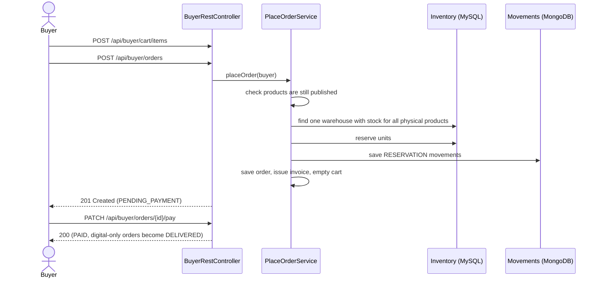
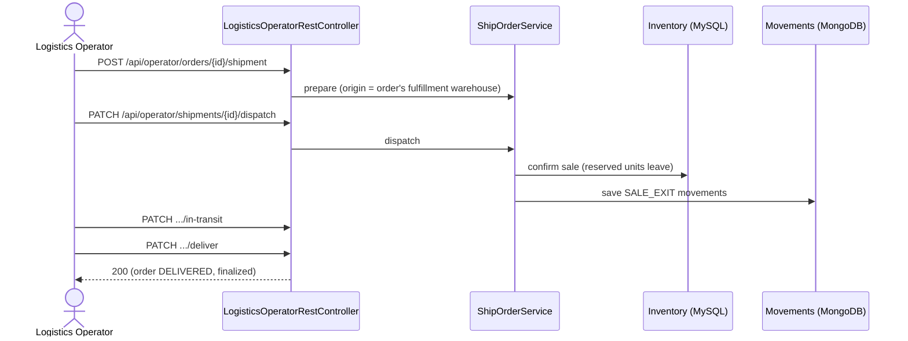
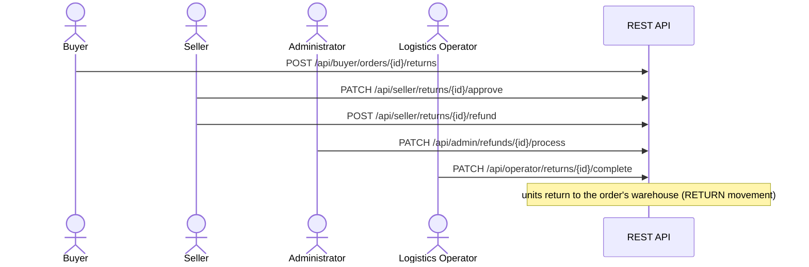
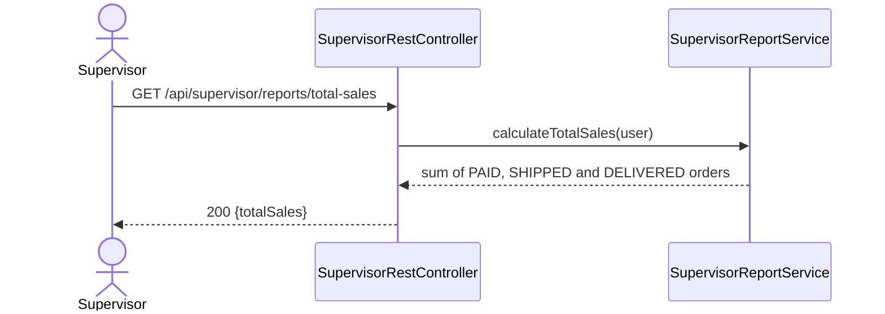

# Endpoint Flows

## 1. Purchase

```mermaid
sequenceDiagram
    actor Buyer
    participant API as BuyerRestController
    participant Place as PlaceOrderService
    participant Inv as Inventory (MySQL)
    participant Hist as Movements (MongoDB)
    Buyer->>API: POST /api/buyer/cart/items
    Buyer->>API: POST /api/buyer/orders
    API->>Place: placeOrder(buyer)
    Place->>Place: check products are still published
    Place->>Inv: find one warehouse with stock for all physical products
    Place->>Inv: reserve units
    Place->>Hist: save RESERVATION movements
    Place->>Place: save order, issue invoice, empty cart
    API-->>Buyer: 201 Created (PENDING_PAYMENT)
    Buyer->>API: PATCH /api/buyer/orders/{id}/pay
    API-->>Buyer: 200 (PAID, digital-only orders become DELIVERED)
```

## 2. Shipment

```mermaid
sequenceDiagram
    actor Operator as Logistics Operator
    participant API as LogisticsOperatorRestController
    participant Ship as ShipOrderService
    participant Inv as Inventory (MySQL)
    participant Hist as Movements (MongoDB)
    Operator->>API: POST /api/operator/orders/{id}/shipment
    API->>Ship: prepare (origin = order's fulfillment warehouse)
    Operator->>API: PATCH /api/operator/shipments/{id}/dispatch
    API->>Ship: dispatch
    Ship->>Inv: confirm sale (reserved units leave)
    Ship->>Hist: save SALE_EXIT movements
    Operator->>API: PATCH .../in-transit
    Operator->>API: PATCH .../deliver
    API-->>Operator: 200 (order DELIVERED, finalized)
```

## 3. Return and Refund

```mermaid
sequenceDiagram
    actor Buyer
    actor Seller
    actor Admin as Administrator
    actor Operator as Logistics Operator
    participant API as REST API
    Buyer->>API: POST /api/buyer/orders/{id}/returns
    Seller->>API: PATCH /api/seller/returns/{id}/approve
    Seller->>API: POST /api/seller/returns/{id}/refund
    Admin->>API: PATCH /api/admin/refunds/{id}/process
    Operator->>API: PATCH /api/operator/returns/{id}/complete
    Note over API: units return to the order's warehouse (RETURN movement)
```

## 4. Reports

```mermaid
sequenceDiagram
    actor Supervisor
    participant API as SupervisorRestController
    participant Rep as SupervisorReportService
    Supervisor->>API: GET /api/supervisor/reports/total-sales
    API->>Rep: calculateTotalSales(user)
    Rep-->>API: sum of PAID, SHIPPED and DELIVERED orders
    API-->>Supervisor: 200 {totalSales}
```
